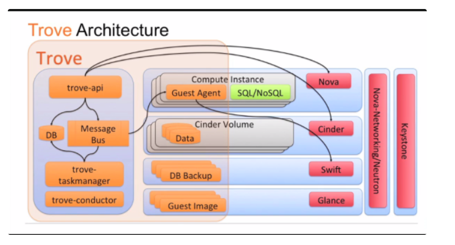

# **Các thành phần của openstac**
- OpenStack gồm rất nhiều thành phần, trong đó có thành phần core (phải có), có thành phần được phát triển với các mục đích riêng của các công ty triển khai

- Core:
  - Nova
  - Keystone
  - Glance
  - Neutron
- Add:
  - Horizon
  - Cinder
  - Ceilometer
  - Heat ....

# 1. Keystone -Identity

- Cung cấp các dịch vụ nhận dạng và xác thực
- Theo dõi và cho phép người dùng 
- Cung cấp mội danh mục các dịch vụ sẵn có với endpoints

  - Một người
  - Dịch vụ (nova, cinder, neutron... )
  - Điểm cuối (một địa chỉ mạng có thể truy cập như một URL, RESTFUL API)

- Các dịch vụ:

  - **Identity**:
    - Dịch vụ nhận dạng, cung cấp xác nhận chứng chỉ, dữ liệu người dùng, nhóm...
    - Basic case: Các dữ liệu được quản lý bởi các dịch vụ, cho phép quản lý các CRUD kết hợp với các dữ liệu.
    Other cases:
  - **Token**
    - Viêc xác nhận dịch vụ Tokens được dùng dể xác thực yêu cầu một khi thông tin của người dùng đã được xác minh.
  - **Catalog**
    - Cung cấp một endpoint đăng ký để phát hiện các endpoint
  - **Policy**
    - Các dịch vụ chính sách cung cấp nguyên tắc cho phép và giao diện quản lý quy tắc liên quan.

- Các thành phần 
  - Key Valua Store: Một giao diện hỗ trợ tra cứu khóa chính, như một từ điển trong bộ nhớ 
  - Memcached: Hệ thống phân phối bộ nhớ đệm
  - Strutured Query Language (SQL): Sử dụng SQLAlchemy(Một bộ công cụ Python SQL và Object Relational Mapper) để lưu trữ dữ liệu liên tục
  - Pluggable Authenticatio Module(PAM): Sử dụng dịch vụ PAM hệ thống địa phương để xác thực 
  - Lightweight Directory Access Protocal (LDAP): Kết nối thông qua LDAP vào một thư mục backend, như Active Directory, để xác thực người sử dụng và có được thông tin vai trò

# 2. Nova - Compute
- Là một module dùng để quản lý các trường máy ảo, nó là một liwps trừu tượng có giao diện và hỗ trợ siêu giám sát
- Hypervisors: KVM, ESXI của VMware , Hyper-VMware

- Các thành phần:

  - Nova-api service: Chấp nhận và phản hồi các yêu cầu API của người dùng cuối. Hỗ trợ Compute API, Amazon EC2 API, và API quản trị đặc biệt.
  - Nova-api-metadât service: Chấp nhận các yêu cầu siêu dữ liệu từ các trường. Dịch vụ được sử dụng ở chế độ đa máy chủ với nova-network.
  - Nova-compute service: tạo vào xóa máy ảo thông qua các API Hypervisor XenAPI for XenService/XCP libvirt for KVM or QEMU VMware API for VMware
  - Nova-conductor module: là trung gian giữa nova-compute và dữ liệu
  - Nova-cert module: Máy chủ phục vụ cho dịch vụ Nova Cert cho chứng thực X509. Tạo các giấy chứng nhận cho euca-bundle-image. Chỉ cần thiết cho EC2 API.
  - Nova-network worker daemon: chấp nhận nhiệm vụ kết nối mạng ừ hàng đợi và vận hành mạng. Thực hiện thiết lập cầu nối giao diện hoặc thay đổi quy tắc iptables
  - Nova-consoleauth daemon: là một trình nền máy chủ phục vụ dịch vụ Nova Console Auth, cung cấp xác thực cho Nova Console.
  - Nova-novncproxy daemon: Cung cấp một proxy để truy cập các trường hợp chạy qua một kết nối VNC. Hỗ trợ khách hàng novnc dựa trên trình duyệt.
  - Nova-spicehtml5proxy daemon: Cung cấp một proxy để truy cập các trường hợp thông qua kết nối SPICE. Hỗ trợ khách hàng qua trình duyệt HTML5.
  - Nova-xvpvncproxy daemon: Cung cấp một proxy để truy cập các trường hợp thông qua kết nối VNC. Hỗ trợ khách hàng qua OpenStack-specific Java.
  - Nova-cert daemon: Chứng thực X509
  - Nova client: Cho phép người dùng sử dụng commands như một quản trị hoặc người dùng cuối.
  - The queue: Một vòng trung tâm để thông qua các tin nhắn giữa các daemon. Thường được thực hiện với RabbitMQ hoặc hàng đợi thông điệp AMQP như Zera MQ.
  - SQL database: Chứa các build-time và run-time cho một cơ sở hạ tầng Cloud, bao gồm: Available instance types Instances in use Available networks Projects Trên lý thuyết OpenStack Compute có thể hỗ trợ cơ sở dữ liệu SQL-Alchemy, SQLite3, MySQL và PostgreSQL.

- Message Queue và back-end database rất quan trọng để vận hành Nova
- Message Queue có thể là các nhóm tin AMPQ, nhưng sử dụng phổ biến là RabbitMQ, Apache Qpid (Red Hat OpenStack) và ZeroMQ.

# 3. Glance – Image Service
- OpenStack Image Service cung cấp, thu hồi, lưu trữ và phân chia siêu dữ liệu cho các images được dùng bởi Nova
- OpenStack Object Storage cho phép người dùng lưu trữ và lấy hình ảnh thông qua một dịch vụ web đơn giản.
- Glance bắt tau với Nova để cũng cấp hỗ trợ co dự phòng máy ảo. Nó cũng có sự tương tác với Keystone để xác thực API.

Các thành phần:

  - Glance-api: chấp nhận các yêu cầu Image API để phát hiện image, truy suất là lưu trữ image.
  - Glance-registry: Lưu trữ xử lý và lấy siêu dữ liệu về image(kích thước, loại...)
  - Glance database: cơ sở dữ liệu lưu trữ siêu dữ liệu image.
  - A storage repository: lưu trữ cá file image thực Glance hỗ trợ tập tin hệ thống bình thường, thiết bị khối RADOS, Amazon S3, HTTP, Swift.
  - Metadata definition service: API phổ biết cho các nhà cung cấp, quản trị, dịch vụ, người dùng... có ý nghĩa xác định siêu dữ liệu tùy chỉnh của riêng họ. Metadata có thể được sử dụng trên các loại khác nhau của các nguồn tài nguyên.

Danh sách các định dạng Disk và Container được hỗ trợ

- Disk format

Định dạng | Mô tả
---|---
raw|định dạng có cấu trúc 
vhd| Disk của máy ảo VMware, Xen...
vmdk| Hôx trợ nhiều máy ảo phổ biến
vdi| hỗ trợ bởi VirtuaBox, QEMU
iso| định dạng lưu trữ dữ liệu của đĩa quang học
cow2| hỗ trợ bởi QEMU
aki|	Amazon kernel image
ari|	Amazon ramdisk image
ami|	Amazon machine image

- Container format Dùng để xem virtual machine image như một định dạng tập tin, nó có thể chứa siêu dữ liệu về máy ảo thực tế.

Định dạng | mô tả 
---|---
bare| không lưu trữ hoặc đóng gói siêu dữ liệu
ovf| định dạng OVF
aki|	Amazon kernel image
ari|	Amazon ramdisk image
ami|	Amazon machine image
ova|	tập lưu trữ OVA tar

- Glance API

  - API có một vai trò quan trọng với Glance để xử lý hình ảnh
 Có 2 phiên bản của Glance API - version 1 và version 2 
  - Glance API version 2  cung cấp tiêu chuẩn một số thuộc tính tùy chỉnh của image. 

# 4.Cinder – Block Storage Service

- Cinder là một dịch vụ lưu trữ khối (Block Storage service) cho OpenStack. Nóc được thiết kế để cho phép sử dụng hoặc là một thực hiện tham chiếu(LVM) để trình bày tài nguyên cho người dùng có thể được sử dụng bởi OpenStack compute Project (Nova). 
- Các mô tả ngắn về Cinder là virtualizes pool các thiết bị lưu trữ khối và cung cấp cho người dùng cuối với một API tự phục vụ yêu cầu và tiêu thụ các nguồn tài nguyên mà không cần bất kỳ kiến ​​thức về nơi lưu trữ của họ được thực sự triển khai hoặc vào loại thiết bị.
- Self service API được sử dụng để giao tiếp với các dịch vụ Cinder.

Kiến trúc Cinder

**Cinder-api**
- Ứng dụng WSGI xác nhận và định tuyến yêu cầu cho các Block Storage service
- Yêu cầu đưuọc gửi tới Cinder-scheduler để chuyển cho cinder-volumes thích hợp

**Cinder-scheduler**
- Dựa vào việc yêu cầu thông điệp yêu cầu chuyển tới Cinder Volume service thích hợp thonog qua AMPQ (RabiitMQ or Qpid)

- Có thể cấu hình để dùng round-robin.
- Filter Scheduler là chế độ xác định mặc định nơi để gửi volume  dựa  trên năng lực, khu sẵn có, lại  và khả năng bộ lọc tùy chỉnh

**Cinder-volume**

- Quẩn lý các khối lưu trữ back-end khác nhau
- Tương tác trực tiếp với phần cứng hoặc phần mềm cung cấp các lưu trữ khối
- Cung cấp cái nhìn từ volume cho người sử dụng.

**Cinder-backup**

-  Cung cấp dịch vụ sao lưu của Cinder volumes cho OpenStack Swift

**Messaging queue**

- Định tuyến thông tin giữa các tiến trình của Block Storage

Thành phần Cinder

  - **Back-end Storage Devices**

    - Mặc định sử dụng LVM(Logical Volume Manager) trên nhóm local volume (cinder-volumes)
    - Hỗ trợ các thiết bị như mảng external RAID hoặc các thiết bị lưu trữ
    - Kích thước Block có thể điều chỉnh khi dùng KVM hoặc QEMU

  - **Users and Tenants/Projects**

    - Dùng Role-based Access Control (RBAC) cho nhiều người thuê
    - Sử dụng “policy.json” để duy trì các quy tắc cho mỗi vai trò
    - Volume truy cập là mỗi người dùng
    - Hạn ngạch để kiểm soát tiêu thụ tài nguyên trên tài nguyên phần cứng có sẵn đều là giá thuê
    - Hạn ngạch có thể được sử dụng để kiểm soát: số lượng volume và ảnh chụp mà có thể được tạo ra cũng như tổng số GBs phép cho mỗi người thuê
  - **Volumes, Snapshots and Backups**

    - Volumes: Phân bổ tài nguyên lưu trữ khối có thể được gắn liền với các trường hợp như lưu trữ thứ cấp hoặc chúng có thể được sử dụng như là các kho chứa gốc để khởi động các trường hợp.
    - Là thiết bị lưu trữ khối R/W gắn kết thường được gắn liền với các nút tính toán thông qua iSCSI.
    - Snapshots: Một điểm chỉ đọc trong thời gian sao chép của volume. Các snapshot có thể được tạo ra từ volume đang sử dụng hoặc có sẵn. Các snapshot có thể được dùng để tạo ra volume mới.
    - Backups: Một bản sao lưu của volume được lưu trữ trong OpenStack Object Storage.

# 5.Swift
- Object Storage Service Object Storage như là một nền tảng mạnh mẽ, khả năng mở rộng và lưu trữ chịu lỗi cho dữ liệu phi cấu trúc như các đối tượng. Đối tượng được lưu trữ bit, truy cập thông qua một giao diện dựa trên HTTP. Bạn không thể truy cập dữ liệu ở các khối hoặc tập tin cấp. Object Storage thường được sử dụng để lưu trữ và sao lưu dữ liệu, với trường hợp sử dụng trong virtual machine image, hình ảnh, video và âm nhạc.

- Kiến trúc OpenStack Swift

` - Proxy Nodes: Là điểm tương tác với "Swift clients" và xử lý các yêu cầu và tiến trình.`
` - Storage Nodes: Là điểm mà máy chủ lưu trữ các objects.`

Các thành phần: 

- Proxy servers : Chấp nhận các OpenStack Object Storage API và các yêu cấu HTTP để upload dữ liệu, chỉnh sửa siêu dữ liệu, tạo các container.
- Account servers : Quản lý các tài khoản của Object Storage.
- Container servers : Quản lý kết nối của các container hoặc thư mục trong Object Storage.
- Object servers: Quản lý đối tượng thực tế như các file trên các nút lưu trữ.
- Various periodic processes: Thực hiện nhiệm vụ thu dọn trên các store dữ liệu lớn.
- WSGI middleware: Xử lý xác thực, thường là OpenStack Identity.
- Swift client: Cho phép user dùng trình lệnh để REST API thông qua command-line.
- Swift-init: Các Script khởi tạo kiến trúc kết nối của file.
- Swift-recon: Công cụ li để thu thập các dữ liệu khác nhau và các thông tin từ xa về một cụm đã được thu thập bởi các swift-recon trung gian.
- Swift-ring-builder: Vòng lưu trữ xây dựng và tái cân bằng tiện ích.

# 6. Neutron – Networking Service
- Một dịch vụ độc lập thường triển khai một số quy trình qua một số nút. Các quá trình tương tác với nhau và với dịch vụ openstack khác.
- Cung cấp dịch vụ mạng.
- Thay thế nova-network để hướng tới SDN trong OpenStack.
- Có nhiều ddịch vụ cao cấp: FWaas, LBaaS, VPNaaS.
- Có cơ chế Plugin để làm việc với các hãng và giải pháp về network khác.

Các thành phần của Neutron 

| Thành Phần | Chức năng |
 |---|---|
 | Neutron server (neutron-server and neutron--plugin) | Dịch vụ này chạy trên các nút mạng để phục vụ các Networking API và phần mở rộng của nó. Nó cũng thực thi các mô hình mạng và địa chỉ IP của mỗi cổng |
  | Plugin agent (neutron--agent) | Chạy trên mỗi nút tính toán để quản lý các cấu hình chuyển mạch ảo (vSwitch) địa phương |
   | DHCP agent (neutron-dhcp-agent) | Cung cấp dịch vụ DHCP cho mạng người thuê. Thành phần này là như nhau trên tất cả các plug-in và chịu trách nhiệm cho việc duy trì cấu hình DHCP | 
   | L3 agent (neutron-l3-agent) | Cung cấp L3 / NAT chuyển tiếp để truy cập mạng bên ngoài của máy ảo trên mạng người thuê | 
   | Network provider services (SDN server/services) | Cung cấp các dịch vụ mạng bổ sung cho mạng lưới thuê. Những dịch vụ SDN có thể tương tác với các neutron-server, neutron-plugin, và / hoặc plugin-đại lý thông qua các API REST hoặc các kênh truyền thông khác |

**Neutron API**

- *Network* - Một phân khúc L2 biệt lập, tương tự như VLAN trong thế giới mạng vật lý
- *Subnet* - một khối địa chỉ IPv4 hoặc v6 và trạng thái cấu hình liên kết
- *Port* - Môt điểm kết nối để gắn một thiết bị duy nhất, chẳng hạn như các NOC của một máy chủ ảo, với một mạng ảo. Cũng mô tả các cấu hình mạng liên quan, chẳng hạn như MAC và địa chỉ IP cũng được sử dụng trên cổng đó.

**Neutron plug-ins** 
- Plugin là giao diện giữa các công nghệ backend như SDN, Cisco, VMware NSX
- Một plugin không liên quan trực tiếp đến các nhà cung cấp bên thứ 3 nhưng là một plugin rất quan trọng là ML2 (Modular Layer 2) Nếu không có trình điều khiển ML2, Neutron chỉ có thể cung cấp một loại hình dịch vụ lớp 2 vì các hoạt động là độc lập.

# 7. Horizon
- Dashboard Cung cấp một giao diện người dùng trên web tới các dịch vụ OpenStack bao gồm Nova, Swift, Keystone, vv Dashboard

# 8. Heat – Block Orchestration
- Dùng để triển khai các dịch vụ theo mẫu có sẵn
- Khả năng tính toán, mở rộng hoặc thu hồi tài nguyên
- Là tab “stack” ở trong Horizon

Các thành phần

- Heat command-line client: CLI giao tiếp với Heat-Api để chạy AWS CloudFormation APIs.
- Heat-api: Một OpenStack-native REST API xử lý các yêu cầu API bằng cách gửi chúng tới heat-engine qua Remote Procedure Call.
- Heat-api-cfn: Một AWS Query API tương thích với AWS CloudFormation. Nó xử lý yêu cầu API bằng cách gửi tới heat-engine.
- Heat-engine: Cung cấp các mẫu và sự kiện lại cho người dùng API

# 9. Ceilometer – Bock Telemetry

- Cung cấp cơ sở hạ tầng để thu thập mọi thông tin cần thiết liên quan tới openstack
- 3 Nhiệm vụ chính của Ceilometer
  - Mêtrring 
  - Multi - Publishing
  - Alarming

## 9.1  Telemetry Data Collection service
- Tính năng: 
  - Thu thập các dữ liệu liên qua tới dịch vụ OpenStack
  - Thu thập sự kiện, đo dữ liệu bằng cách giám sát các thông báo.
  - Cung cấp các dữ liệu được thu thập cho các mục tiêu khác nhau gồm kho lưu trữ và hàng đợi tin nhắn. 
- Các thành phần
  - *A compute agent* chạy trên các compute node và  thống kê sử dụng các nguồn lực.
  - *Acentral agent*: chạy trên máy chủ quản lý tập trung để thống kê sử dụng các nguồn tài nguyên không gán với các trường hợp hoặc các compute node
  - *A notification agent* : Chạy trên các máy chủ quản lý tập trung và sử dụng các thông điệp từ hàng đợi thông điệp để xây dựng sự kiện và định lượng dữ liệu.
  - *An API server*: chạy trên một hoặc nhiều máy chủ quản lý để cung cấp truy cập dữ liệu từ kho dữ liệu.

## 9.2  Telemetry Alarming service

- Dịch vụ báo động từ xa khi các quy định bị phá vỡ.

Các thành phần:

- An API server (aodh-api): Cung cấp truy cập vào các thông tin báo động lưu trữ trong kho dữ liệu.
- An alarm evaluator (aodh-evaluator):
- A notification listener (aodh-listener): Quyết định khi nào kich hoạt báo động.
- An alarm notifier (aodh-notifier): Cho phép báo động được thiết lập dựa trên các ngưỡng đánh giá với mẫu thu thập.

# 10. Trove – Database Service
- Là một dịch vụ cho phép người dùng sử dụng cơ sở dữ liệu mà không cần quản lý cơ sở hạ tầng cơ sở dữ liệu.
- Với nhiệm vụ đảm bảo khả năng mở rộng và độ tin cậy cơ sở dữ liệu đám mây. Có khả năng back up và hỗ trợ SQL/NoSQL.

- Mô hình :

- Các thành phần chính: 

  - Python-troveclient: CLI giao tiếp với các thành phần trove-api.
  - Trove-api: Cung cấp OpenStack-native RESTful API hỗ trợ JSON để cung cấp và quản lý các trường Trove.
  - Trove-conductor: Chạy trên máy chủ và nhận tin nhắn từ các trường khách muốn truy cập thông tin trên máy chủ.
  - Trove-taskmanager: Hỗ trợ các dự phòng các trường hợp, quản lý vòng đời và thực hiện các hoạt động trên các trường.
  - Trove-guestagent: Chạy trên trường khách. Quản lý và thực hiện các hoạt động trên cơ sở dữ liệu riêng của mình.

# 11. Manila – Shared File Systems

- Cung cấp lưu trữ tập tin vào một máy ảo. Các dịch vụ hệ thống tập chung cung cấp một cơ sở hạ tầng cho việc quản lý và dự phòng của file chia sẻ. Dịch vụ này cũng cho phép quản lý các loại kiểu chia sẻ cũng như chia sẻ những bức ảnh nếu trình điều khiển hỗ trợ.

Các thành phần:

- Manila-api: Một ứng dụng WSGI xác nhận và định tuyến các yêu cầu cho Shared File Systems service.
- Manila-data: Một dịch vụ độc lập. Nhận các yêu cầu, quá trình hoạt động dữ liệu và gửi phản hồi sau khi hoạt động hoàn thành.
- Manila-scheduler: Lập lịch và định tuyến các yêu cầu tới các dịch vụ chia sẻ thích hợp.
Manila-share: Quản lý các thiết bị đầu cuối mà cung cấp chia sẻ tập tin hệ thống.
- Messaging queue: Định tuyến thông tin giữa các tiến trình Shared File Systems.

# Tham khảo 

- https://fantasista.vn/cac-thanh-phan-trong-openstack/